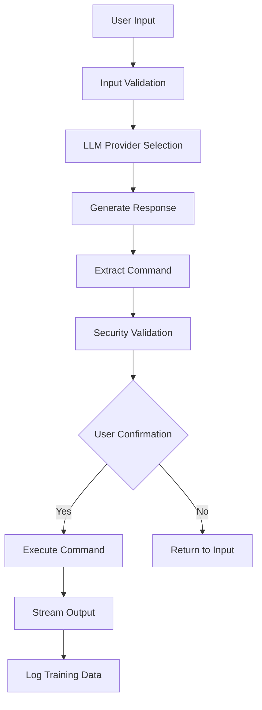
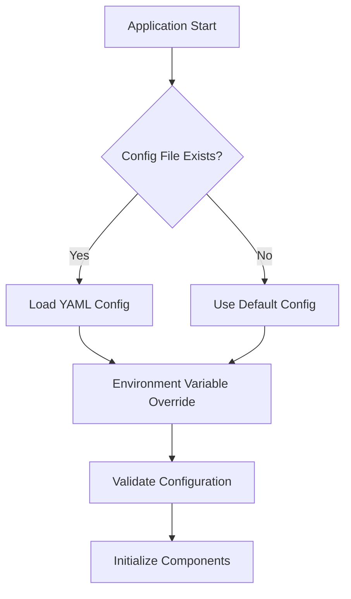
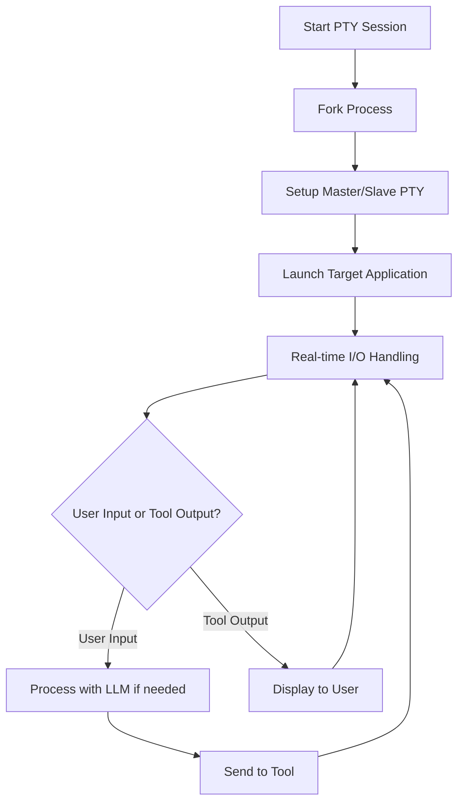

# Architecture Overview

This document provides a comprehensive overview of AI Shell's architecture, design patterns, and component interactions.

## 🏗️ High-Level Architecture

```
┌─────────────────────────────────────────────────────┐
│                   User Interface                    │
│                     (ui.py)                        │
└─────────────────────┬───────────────────────────────┘
                      │
┌─────────────────────▼───────────────────────────────┐
│                  Main Application                   │
│                   (main.py)                        │
│  ┌─────────────┬─────────────┬─────────────────────┐│
│  │ Mode        │ Provider    │ Security            ││
│  │ Selection   │ Management  │ Validation          ││
│  └─────────────┴─────────────┴─────────────────────┘│
└─────────────────────┬───────────────────────────────┘
                      │
        ┌─────────────┼─────────────┐
        │             │             │
        ▼             ▼             ▼
┌─────────────┐ ┌──────────────┐ ┌──────────────┐
│Configuration│ │ LLM Provider │ │ Command      │
│ Management  │ │ (llm.py)     │ │ Executor     │
│ (config.py) │ │              │ │ (executor.py)│
└─────────────┘ └──────────────┘ └──────────────┘
        │             │             │
        └─────────────┼─────────────┘
                      │
        ┌─────────────▼─────────────┐
        │     External Services     │
        │                          │
        │ ┌─────────┐ ┌───────────┐ │
        │ │ Gemini  │ │ Ollama    │ │
        │ │ API     │ │ Local LLM │ │
        │ └─────────┘ └───────────┘ │
        │                          │
        │ ┌─────────┐ ┌───────────┐ │
        │ │MSFConsole│ │  System   │ │
        │ │   PTY    │ │ Commands  │ │
        │ └─────────┘ └───────────┘ │
        └──────────────────────────┘
```

## 🧩 Core Components

### 1. Main Application (`main.py`)

**Responsibilities:**
- Application entry point and CLI argument parsing
- Mode selection and workflow orchestration
- Provider initialization and management
- Interactive terminal handling with PTY support

**Key Functions:**
- `main()`: Primary application entry point
- `setup_logging()`: Logging configuration
- `parse_arguments()`: CLI argument handling
- `interactive_pty_session()`: PTY-based tool integration

**Design Patterns:**
- Command Pattern: Mode selection and execution
- Factory Pattern: Provider instantiation
- Observer Pattern: Real-time output streaming

### 2. Configuration Management (`config.py`)

**Responsibilities:**
- YAML-based configuration loading and validation
- Environment variable integration
- Default value management
- Dynamic configuration updates

**Key Classes:**
```python
class Config:
    def __init__(self, config_data=None, config_file=None)
    def get(self, key, default=None)
    def set(self, key, value)
    def save(self, filename)
```

**Configuration Structure:**
```yaml
llm:
  provider: gemini|local
  gemini:
    api_key: string
    model: string
  local:
    host: string
    port: integer
    model: string

security:
  require_confirmation: boolean
  dangerous_commands: list

logging:
  level: DEBUG|INFO|WARNING|ERROR
  file: string
  format: string

training:
  dataset_file: string
  auto_log: boolean
```

### 3. LLM Provider System (`llm.py`)

**Architecture:**
```python
# Base Provider Interface
class LLMProvider(ABC):
    @abstractmethod
    async def generate_response(self, prompt: str, system_prompt: str = "") -> str
    
    @abstractmethod
    def is_available(self) -> bool

# Concrete Implementations
class GeminiProvider(LLMProvider)
class LocalLLMProvider(LLMProvider)
```

**Provider Selection Logic:**
```python
def get_llm_provider(provider_name: str, config: Config) -> LLMProvider:
    providers = {
        'gemini': GeminiProvider,
        'local': LocalLLMProvider
    }
    return providers[provider_name](config)
```

**System Prompts:**
- `TRANSLATOR_SYSTEM_PROMPT`: Command translation mode
- `ASSISTANT_SYSTEM_PROMPT`: Conversational assistance mode
- `METASPLOIT_SYSTEM_PROMPT`: Security testing mode
- `WAPITI_SYSTEM_PROMPT`: Web application scanning mode

### 4. Command Execution (`executor.py`)

**Security Architecture:**
```python
class CommandExecutor:
    def __init__(self, config: Config)
    
    def validate_command(self, command: str) -> ValidationResult
    def execute_command(self, command: str, confirm: bool = True) -> ExecutionResult
    def is_dangerous_command(self, command: str) -> bool
```

**Security Layers:**
1. **Input Validation**: Command syntax and structure validation
2. **Dangerous Command Detection**: Pattern matching against known dangerous commands
3. **User Confirmation**: Interactive approval for command execution
4. **Output Sanitization**: Safe handling of command output

**Execution Modes:**
- **Interactive**: Real-time output streaming with PTY
- **Batch**: Standard subprocess execution
- **Dry Run**: Validation without execution

### 5. User Interface (`ui.py`)

**Component Categories:**
```python
# Color and Formatting
colors = {
    'primary': '\033[96m',      # Cyan
    'secondary': '\033[95m',     # Magenta
    'success': '\033[92m',       # Green
    'warning': '\033[93m',       # Yellow
    'error': '\033[91m',         # Red
    'info': '\033[94m',          # Blue
    'reset': '\033[0m'           # Reset
}

# UI Components
def print_banner()
def print_mode_selection()
def print_provider_selection()
def format_command_output(output: str) -> str
```

**Responsive Design:**
- Terminal width detection
- Dynamic content wrapping
- Cross-platform color support

## 🔄 Data Flow

### Command Translation Flow



### Configuration Loading Flow



### PTY Session Flow



## 🔒 Security Architecture

### Defense in Depth

1. **Input Layer**
   - Command injection prevention
   - Input sanitization
   - Length and format validation

2. **Validation Layer**
   - Dangerous command detection
   - Pattern matching
   - Whitelist/blacklist enforcement

3. **Execution Layer**
   - User confirmation requirements
   - Process isolation
   - Resource limiting

4. **Output Layer**
   - Output sanitization
   - Sensitive data filtering
   - Logging and auditing

### Threat Model

**Threats Addressed:**
- Command injection attacks
- Malicious LLM responses
- Privilege escalation
- Data exfiltration
- Denial of service

**Mitigations:**
- Input validation and sanitization
- Command whitelisting/blacklisting
- User confirmation workflows
- Process sandboxing
- Resource monitoring

## 🧪 Testing Architecture

### Test Categories

1. **Unit Tests**
   - Individual component testing
   - Mock external dependencies
   - Edge case validation

2. **Integration Tests**
   - Component interaction testing
   - Configuration validation
   - Provider integration

3. **Security Tests**
   - Command injection prevention
   - Dangerous command detection
   - Input validation

4. **End-to-End Tests**
   - Full workflow testing
   - User interaction simulation
   - Real provider integration

### Test Structure

```
tests/
├── unit/
│   ├── test_config.py
│   ├── test_llm.py
│   ├── test_executor.py
│   └── test_ui.py
├── integration/
│   ├── test_provider_integration.py
│   └── test_workflow_integration.py
├── security/
│   ├── test_command_validation.py
│   └── test_injection_prevention.py
└── e2e/
    └── test_full_workflow.py
```

## 📊 Performance Considerations

### Optimization Strategies

1. **Async Operations**
   - Non-blocking LLM API calls
   - Concurrent request processing
   - Real-time response streaming

2. **Caching**
   - Configuration caching
   - Provider initialization caching
   - Response pattern caching

3. **Resource Management**
   - Connection pooling for API calls
   - Memory-efficient output streaming
   - Process lifecycle management

### Scalability

- **Horizontal Scaling**: Multiple provider instances
- **Vertical Scaling**: Resource optimization
- **Load Balancing**: Provider selection strategies

## 🔮 Future Architecture

### Planned Enhancements

1. **Plugin System**
   - Modular tool integration
   - Third-party provider support
   - Custom command handlers

2. **Distributed Architecture**
   - Remote LLM provider support
   - Distributed configuration management
   - Multi-user support

3. **Advanced Security**
   - Role-based access control
   - Audit logging
   - Compliance frameworks

4. **Machine Learning**
   - Local model fine-tuning
   - Usage pattern analysis
   - Predictive command suggestions

This architecture enables AI Shell to be maintainable, extensible, and secure while providing a rich user experience for command-line operations.